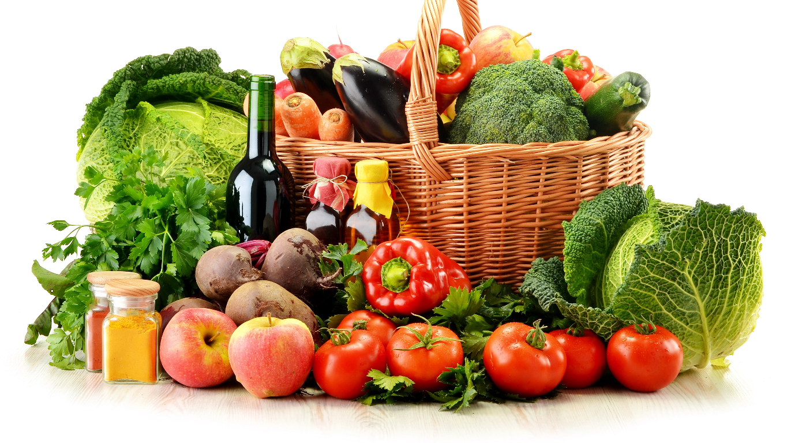
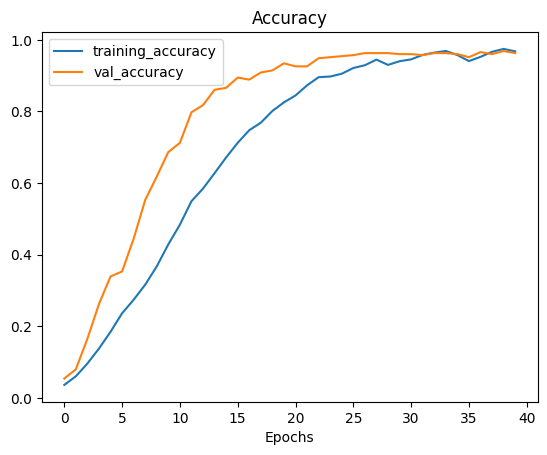
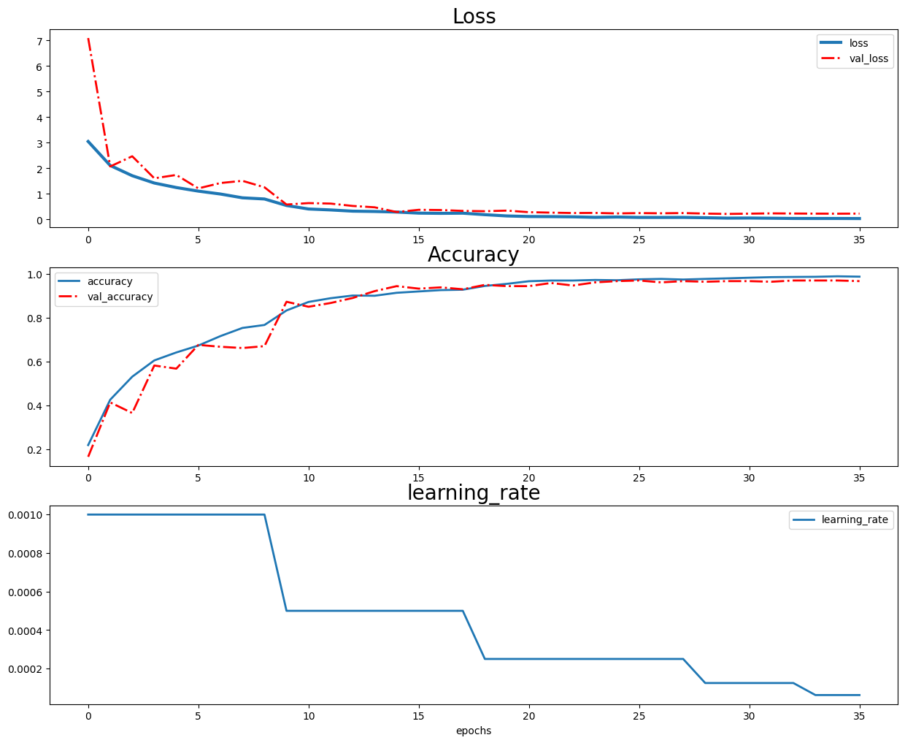
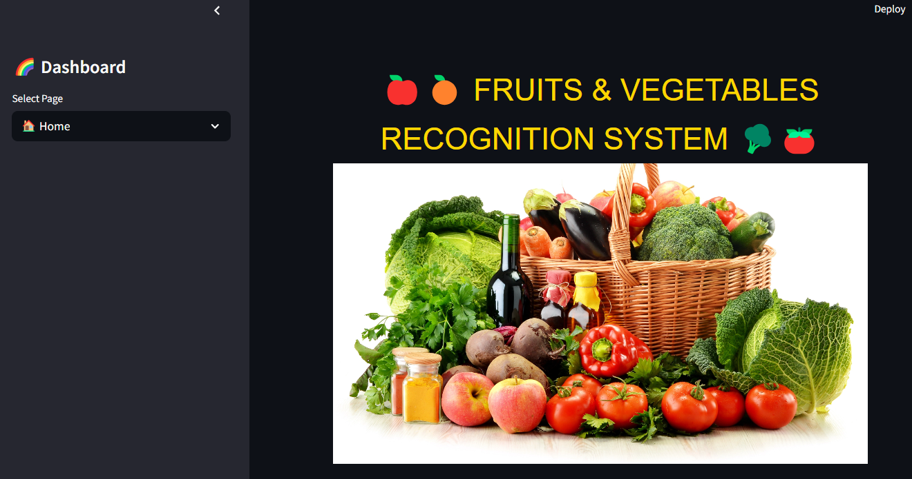
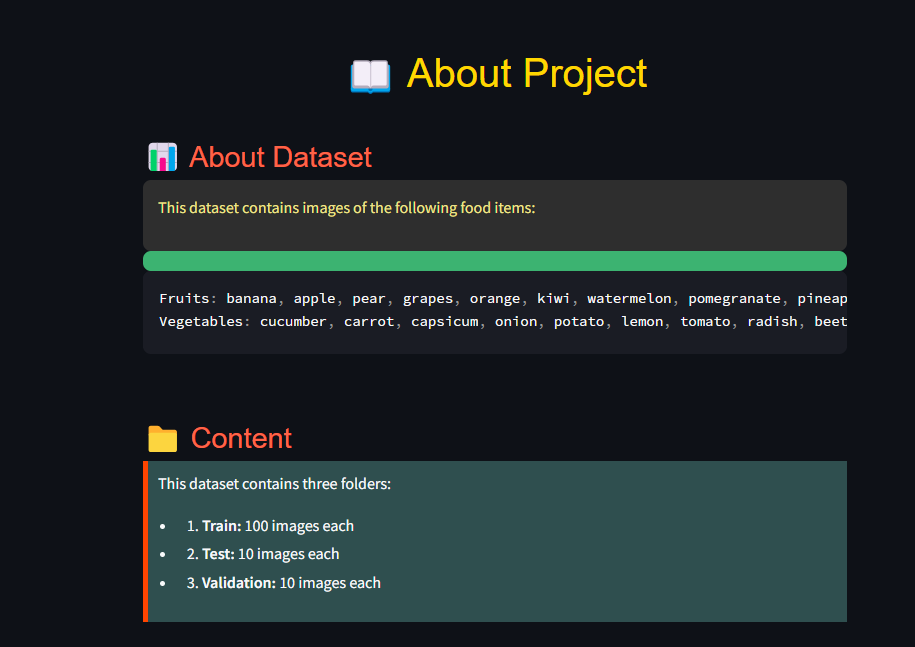

# Fruits and Vegetables Recognition System

## Table of Contents
- [Description](#description)
- [Data](#data)
- [Model](#model)
- [Technologies](#technologies)
- [Usage](#usage)
- [Screenshots](#screenshots)

## Description
This project aims to develop an application that recognizes food items from captured photos and provides users with various recipes that can be made using those food items.

## Data
The dataset used for this project consists of images of various fruits and vegetables. Each image is labeled with the corresponding food item. The data is split into training, validation, and test sets to evaluate the model's performance.
[Kaggle Data](https://www.kaggle.com/datasets/kritikseth/fruit-and-vegetable-image-recognition/data)

## Model
The model is built using a convolutional neural network (CNN) to classify the food items in the images. The model's architecture includes several convolutional layers followed by max-pooling layers and fully connected layers. Additionally, the MobileNetV2 model is used for its efficiency and accuracy in image classification tasks. The model is trained using the training dataset and validated using the validation dataset. 

## Technologies
- **Streamlit**: Used for building the web application interface.
- **TensorFlow/Keras**: Used for building and training the CNN model.
- **OpenCV**: Used for image processing.
- **Pandas**: Used for data manipulation and analysis.
- **NumPy**: Used for numerical computations.

## Usage
1. Clone the repository.
2. Install the required dependencies.
3. Run the Streamlit application.
4. Upload a photo of a food item.
5. Get the predicted food item and recipes.

## Screenshots
### Model Accuracy History
**Model Accuracy (CNN)**

**Model Accuracy (MobileNetV2)**

### Web Application

### Prediction Page

